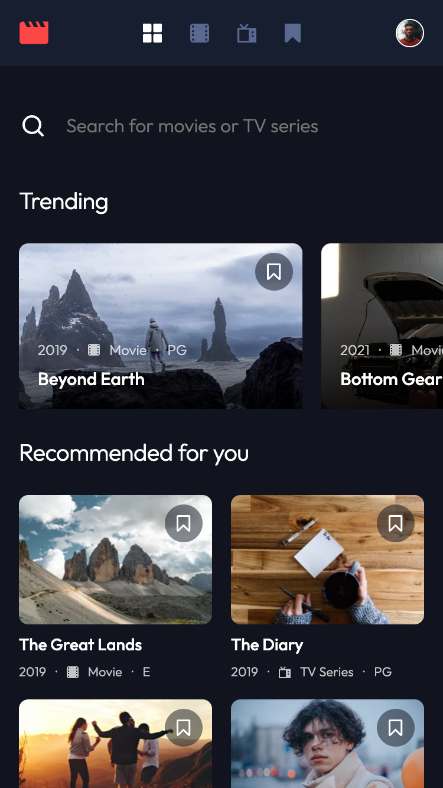
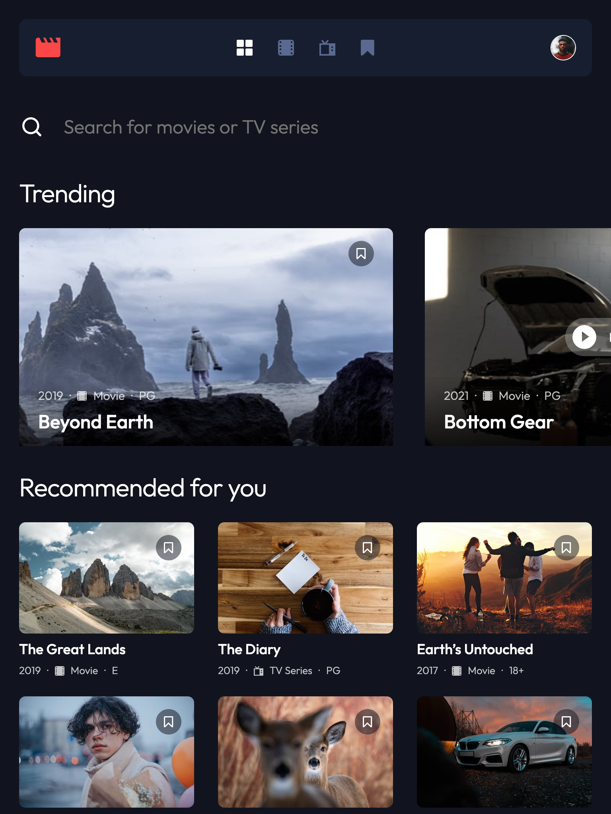
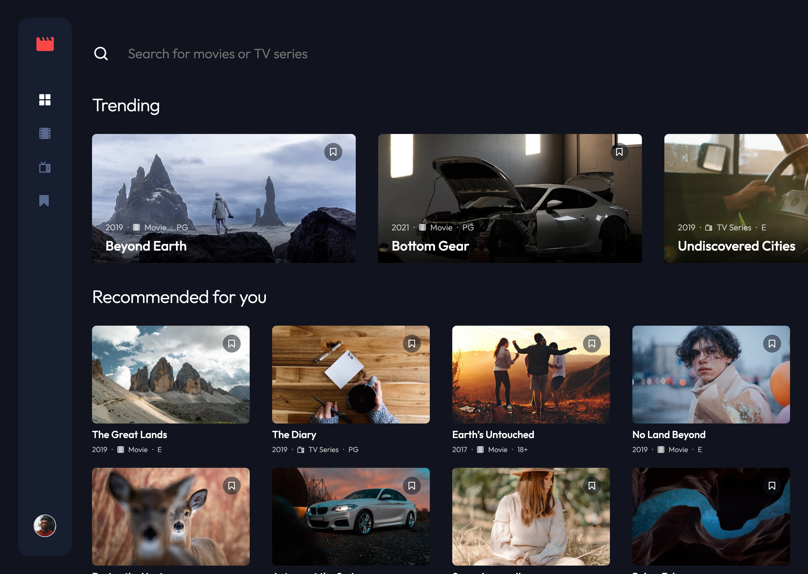

# Frontend Mentor - Entertainment web app solution

This is a solution to the [Entertainment web app challenge on Frontend Mentor](https://www.frontendmentor.io/challenges/entertainment-web-app-J-UhgAW1X). Frontend Mentor challenges help you improve your coding skills by building realistic project.

I completed this challenge as part of the [JavaScript frameworks and libraries](https://www.frontendmentor.io/learning-paths/javascript-frameworks-and-libraries-JDWoqQjMyb) Frontend Mentor learning path. This continues my efforts to learn my chosen JS Framework - [Vue.js](https://vuejs.org/) + [Pinia](https://pinia.vuejs.org/) + [Vue Router](https://router.vuejs.org/).

## Table of contents

- [Overview](#overview)
  - [The challenge](#the-challenge)
  - [Screenshots](#screenshots)
  - [Links](#links)
- [My process](#my-process)
  - [Built with](#built-with)
  - [What I learned](#what-i-learned)
  - [Continued development](#continued-development)
  - [Useful resources](#useful-resources)
- [Author](#author)

## Overview

### The challenge

Users should be able to:

- View the optimal layout for the app depending on their device's screen size
- See hover states for all interactive elements on the page
- Navigate between Home, Movies, TV Series, and Bookmarked Shows pages
- Add/Remove bookmarks from all movies and TV series
- Search for relevant shows on all pages
- **Bonus**: Build this project as a full-stack application
- **Bonus**: If you're building a full-stack app, we provide authentication screen (sign-up/login) designs if you'd like to create an auth flow

### Screenshots

|           Mobile designed at 375px:           |          Tablet designed at 1440px:           | Desktop designed at 1440px:                    |
| :-------------------------------------------: | :-------------------------------------------: | ---------------------------------------------- |
|  |  |  |

### Links

- Solution URL: [https://github.com/elisilk/entertainment-web-app](https://github.com/elisilk/entertainment-web-app)
- Live Site URL: [https://elisilk.github.io/entertainment-web-app/](https://elisilk.github.io/entertainment-web-app/)

## My process

### Built with

- Semantic HTML5 markup
- CSS custom properties
- Flexbox
- CSS Grid
- Mobile-first workflow
- Accessibility
- [Vite](https://vite.dev/)
- [Vue](https://vuejs.org/)
- [Pinia](https://pinia.vuejs.org/)
- [Vue Router](https://router.vuejs.org/)

### What I learned

As always, so many cool :sunglasses: things. Here are some of the key resources I used:

- Vue
  - [Class and Style Bindings](https://vuejs.org/guide/essentials/class-and-style)
- Pinia
  - [Defining a Store > Setup Stores](https://pinia.vuejs.org/core-concepts/#Setup-Stores) - I tried for the first time the alternate syntax form for setting up Pinia Stores called the "Setup Stores" syntax. This syntax more closely mirrors the [Vue's Composition API](https://vuejs.org/guide/extras/composition-api-faq) (vs the [Options API](https://vuejs.org/guide/introduction.html#api-styles)).- Vue Router
  - [Vue Examples - Computed with v-model](https://skirtles-code.github.io/vue-examples/patterns/computed-v-model)
  - [Active links](https://router.vuejs.org/guide/essentials/active-links)
  - [Passing Props to Route Components](https://router.vuejs.org/guide/essentials/passing-props.html)
- Working with images in Vue - This is still a bit mysterious and frustrating to me. I'm not 100% sure when it breaks and when it works.
  - [Vue 3 + Vite image URL becomes undefined after build](https://stackoverflow.com/questions/71728204/vue-3-vite-image-url-becomes-undefined-after-build)
  - [Vite Static Asset Handling](https://vite.dev/guide/assets)
  - [Working with Image Assets](https://skirtles-code.github.io/vue-examples/guides/working-with-image-assets)
  - [How to use images with Vite and Vue](https://medium.com/@andrewmasonmedia/how-to-use-images-with-vite-and-vue-937307a150c0)
- Horizontal scrolling
  - [How To Create Horizontal Scrolling Containers](https://codeburst.io/how-to-create-horizontal-scrolling-containers-d8069651e9c6)
  - [How to implement horizontal scrolling using Flexbox](https://ratracegrad.medium.com/horizontal-scrolling-using-flexbox-f9d16817f742)
  - [Practical CSS Scroll Snapping](https://css-tricks.com/practical-css-scroll-snapping/)
  - [`scroll-snap-type`](https://developer.mozilla.org/en-US/docs/Web/CSS/scroll-snap-type)
- [Preventing a Grid Blowout](https://css-tricks.com/preventing-a-grid-blowout/)
- [`caret-color`](https://developer.mozilla.org/en-US/docs/Web/CSS/caret-color)
- [Inclusively Hiding & Styling Checkboxes and Radio Buttons](https://www.sarasoueidan.com/blog/inclusively-hiding-and-styling-checkboxes-and-radio-buttons/) - I just LOVE this article and come back to it so often.
- [Inclusive Components - Cards](https://inclusive-components.design/cards/) - I also LOVE this article and come back to it often as well.
  - [Cards demo (alternative text)](https://heydon.github.io/Inclusive-Components/cards-pseudo-content/)
- String searching and manipulating
  - [Convert a string to a SEO-friendly slug with JavaScript](https://www.30secondsofcode.org/js/s/string-to-slug/)
  - [`String.prototype.search()`](https://developer.mozilla.org/en-US/docs/Web/JavaScript/Reference/Global_Objects/String/search)
  - [`String.prototype.includes()`](https://developer.mozilla.org/en-US/docs/Web/JavaScript/Reference/Global_Objects/String/includes)
- [Using CSS gradients](https://developer.mozilla.org/en-US/docs/Web/CSS/CSS_images/Using_CSS_gradients)
- [`:focus-within`](https://developer.mozilla.org/en-US/docs/Web/CSS/:focus-within)

### Continued development

Specific areas that the solution should be improved (known issues):

- [ ] There is a lot of repeated code in the different views. Consolidate into one view that is sent props for different routes.

Specific enhancements I'd like to make (feature requests):

- [ ] ...

More general ideas I want to consider:

Hmm 🤔 ...

- [ ] Read and incorporate the Vue [Style Guide](https://vuejs.org/style-guide/) into the application
- [ ] Finish watching and learning from Vue School's [Vue Router 4 for Everyone: Master Routing in Vue.js](https://vueschool.io/courses/vue-router-4-for-everyone) course
- [ ] Improve my skills with Git
  - using git diff to see changes
  - combining multiple commits into a single push

### Useful resources

- [Vue Guide](https://vuejs.org/guide/)
- [Pinia Guide](https://pinia.vuejs.org/core-concepts/)
- [Vue Router Guide](https://router.vuejs.org/guide/)
- [Vite Guide](https://vite.dev/guide/)
- [MDN Web Docs for CSS](https://developer.mozilla.org/en-US/docs/Web/CSS) - Went here a lot to reference the different CSS properties and the shorthands, and all the great explanations about best practices.

## Author

- Website - [Eli Silk](https://github.com/elisilk)
- Frontend Mentor - [@elisilk](https://www.frontendmentor.io/profile/elisilk)
